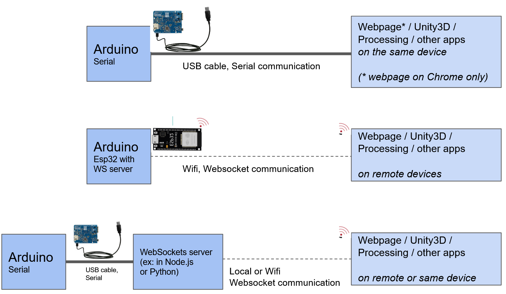

# What is this repository ?

This repository is a collection of simple scripts to connect between Arduinos (ex: ESP32), Webpages, Unity3D AR/VR, Python, Processing P5.JS, etc. It was created for courses like MIT How To Make Almost Anything and Harvard PS70 / T519 Intro to Digital Fabrication where electronic devices are connected through cables or wifi.

Devices / apps that can be connected building on scripts in this repo:

* **Arduinos** including ESP32 (ex: connections over USB serial port, over Wifi websockets, over MIDI, etc)

* **Webpages** (ex: connecting a web XR webpage to ESP32 using Websockets)

* **Processing** (ex: connecting Arduino to a P5JS visualization through websockets, or to Processing4 using usb serial port)

* **Python** (ex: running a websocket server in python)

* **Ableton** (ex: connecting an Arduino to Ableton music using MIDI serial)

# Repository contents

- **Serial**: Scripts for sending sensor data from Arduino, or sending commands to the Arduino.

- **WebSockets**: Scripts for running servers and clients on various devices, and connecting using webpages, Processing P5.js, ESP32, etc.

- **MIDI**: Scripts for communicating MIDI over USB

- **TCP_UDP**: (under construction) Scripts for raw communication through TCP/UDP sockets.

# Introduction: Ways of connecting devices

There are many ways of connecting depending on if you have wires or wireless. 

* In all cases, one device will need to send/receive data to a computer or other device that is able to talk the same protocol. The choice of protocol depends on your setup.

* **Will you talk to your Arduino using USB cable ?** Then you'll do serial communication or MIDI. 

* **Will you talk using wireless ?** Then you'll need to run a client/server setup, e.g. through Websockets or TCP/UDP.

* Here are some example setups:

